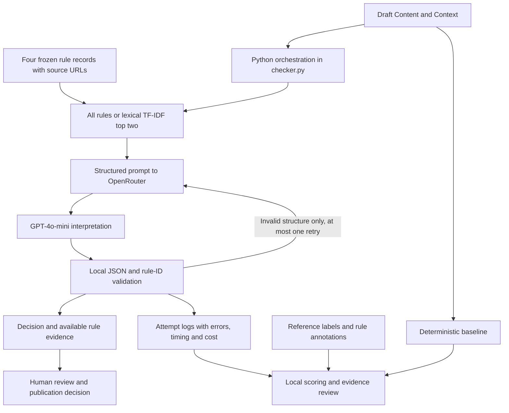

# Product Overview

## Problem and persona

A marketing or partner-integration reviewer must decide whether draft copy, including AI-generated copy, follows brand requirements before publication. The reviewer needs a decision with an inspectable rationale, and a clear indication when facts are missing. This prototype supports that workflow through four selected Spotify developer-guideline rules; it does not assess all advertising, legal, tone or visual requirements.

## Input and output

Input consists of `Content` (the exact label, application name or description) and `Context` (installation status, the role of the wording, and relationship or authorization facts). A case ID links input to local logs. Reference labels, category, reviewer notes and reference rule IDs are not sent as item fields to the model.

Output is `Pass`, `Flag` or `Insufficient evidence`, with `reason`, `rule_ids`, `missing_information` and locally attached rule text/source URLs. Logs add status, selected rules, model identity, timing, tokens and known API cost. A run error is distinct from an abstention. A Pass concerns only applicable supplied checks, not Spotify approval.

## Architecture

The runtime has a fixed sequence; it does not autonomously browse, plan or publish content. Retrieval uses lexical TF-IDF cosine similarity, not embeddings or a vector database. A rule is one chunk; only positive-scoring rules are returned, up to two. The full-context comparison receives all four rules. External intelligence is provided by GPT-4o-mini through the OpenRouter API. The rule corpus is frozen locally rather than fetched at runtime.

## Targets and measured outcomes

| Metric or objective | Target or evaluation intention | Formal outcome |
|---|---|---|
| Decision agreement | At least 90% against frozen references | All rules 40/50 (80%); retrieval 47/50 (94%) |
| False passes | Minimize this costlier error; no numerical threshold was fixed | All rules 7/22; retrieval 1/22 known violations passed |
| Abstention | Match missing evidence to case difficulty; no target rate | All rules 8/50; retrieval 6/50; retrieval correctly abstained on 5/6 reference abstentions |
| Execution reliability | Complete all cases with bounded validation retries | Both 50/50 completed, valid first outputs; zero retries and errors |
| Retrieval coverage | Diagnostic measure, no numerical target fixed | Mean per-case recall@2 83% |
| Evidence support | Review explanations separately from labels | Fully supported: all rules 33/50; retrieval 28/50 |
| Cost per content item | Report actual API charges; no budget threshold fixed | USD 0.000137442 all rules; USD 0.000154890 retrieval |
| Human review-time saving | Initial 30% aspiration withdrawn because proposed timing was biased | Not measured or claimed |

Targets must not be inferred retrospectively from observed results. These outcomes are one formal experiment, not estimates of general advertising compliance.

## Practical value and boundaries

The checker provides a structured first-pass assessment: it identifies potential violations, exposes available requirements and requests missing facts. It does not rewrite the text, verify external agreements or approve publication. T36 remains a false pass, and T42 illustrates incomplete support despite a correct decision. Final human review is necessary. Future evaluation should use new cases after any change and include a blinded reviewer study before claiming time saved.

See [project report](Project_Report.md), [data documentation](../data/README.md), [evaluation documentation](../evals/README.md) and [code map](Code_Map.md).
